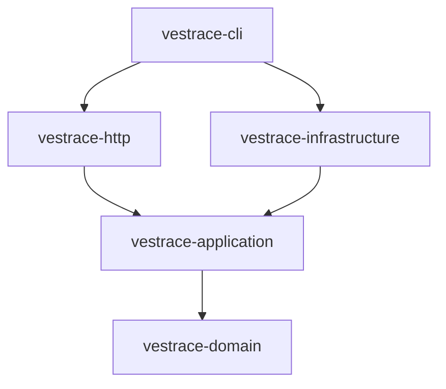

# Vestrace System Architecture

Vestrace is an evidence-first knowledge and execution platform implemented as a Rust Edition 2024 workspace. The current runtime delivers event-sourced run records with deterministic replay and checkpoint recovery, health checks, workspace isolation through RLS, memory lifecycle services, and truthful failure for unavailable product surfaces.

## Workspace structure

The repository contains seven workspace crates plus a root integration-test package:

```text
Cargo.toml
crates/
  vestrace-domain/          # Pure domain types and invariants
  vestrace-application/     # Use cases and ports
  vestrace-infrastructure/  # PostgreSQL and provider adapters
  vestrace-http/            # Axum transport adapter
  vestrace-cli/             # Service and operational CLI
  vestrace-mcp/             # MCP tool server for agent-facing access
  vestrace-rig-spike/       # Experimental provider integration spike
tests/                      # Root integration test suite
migrations/                 # Ordered forward-only SQLx migrations
```

`vestrace-rig-spike` participates in workspace compilation and tests, but it is experimental and is not part of the supported runtime contract.

## Layer dependencies



The intended dependency direction is inward:

- domain code does not depend on Axum, SQLx, HTTP, or infrastructure;
- application code defines use cases and ports without SQLx types;
- infrastructure implements application ports;
- HTTP translates transport requests into application calls;
- CLI performs composition and process startup.

## Current layer responsibilities

### Domain

`vestrace-domain` contains identifiers, value objects, entities, and invariants. The repository includes domain types for capabilities, memory, providers, agents, workflows, and other future areas. Their presence does not imply that those features are available through the supported runtime.

### Application

`vestrace-application` exposes ports and services for the run-record vertical slice and memory lifecycle. The wired services are:

- `RunCommandService` — event-sourced command executor: loads the event stream, replays state, runs the domain decision function, builds event envelopes, reduces them to compute the resulting state, projects to `AgentRun`, and atomically commits events + projection via `RunCommandCommitter`.
- `RunService` — read-side use cases: create/list/get run projections.
- `RunRecoveryService` — checkpoint creation, validation, state restoration from checkpoints + tail events, and projection rebuild.
- `MemoryService` — event recording with idempotency and outbox (`event.recorded`), memory creation with first revision, provenance link, idempotency and outbox (`memory.created`), memory revision with optimistic concurrency, idempotency and outbox (`memory.revised`), and knowledge-relation linking with idempotency and outbox (`memory.relation.linked`).
- `HardPurgeMemoryService` — authorized hard purge that deletes memory content, revisions, sources, relations, and writes a minimal audit row. Requires `PurgeAuthorizationPort` (deterministic test adapter provided).
- `ContextPackBuilder` — token-bounded context pack construction with section ordering, compression ladder (Full → Summary → Atomic → Reference), and conservative byte-based token counting.
- `RetrievalService` — orchestration: normalizes request, runs text retriever channel, fuses via RRF, reranks with deterministic components, builds context pack with token budget, and journals results. Gracefully degrades when channels fail.
- `RedactionService` — regex-based redaction with sensitivity-aware destination filtering. Recursively redacts JSON values.
- `PolicyEngine` — capability-based authorization: `AllowAllPolicyEngine` (local trusted), `CapabilitySetPolicyEngine` (capability set), `WorkspaceScopedPolicyEngine` (workspace + capability).

The memory, jobs, and provider ports are defined and partially wired (see Infrastructure below). A type or service in this crate is not considered production-ready without a wired runtime path and acceptance coverage.

### Infrastructure

`vestrace-infrastructure` provides PostgreSQL pooling, transaction-scoped workspace/principal context, repository adapters, migration execution, migration-history verification, and provider clients.

Wired adapters:

- `PgRunRepository` — run projection CRUD against `agent_runs`.
- `PgRunEventStore` — append-only event stream with optimistic concurrency via `FOR UPDATE` and sequence validation.
- `PgRunCommandCommitter` — atomic event append + projection upsert in one transaction; re-replays stored + new events to verify projection integrity before commit.
- `PgRunRecoveryStore` — checkpoint and event access for run state recovery.
- `PgEventRepository` — event persistence with read path (`find_by_id`). Events are append-only (trigger prevents UPDATE/DELETE).
- `PgMemoryRepository` — memory and revision persistence with read paths (`find_memory_by_id`, `find_revision_by_id`). Active memories require at least one source (deferred constraint trigger).
- `PgProvenanceRepository` — provenance source persistence.
- `PgRelationRepository` — knowledge relation persistence.
- `PgJobRepository` — job enqueue, lease (`FOR UPDATE SKIP LOCKED`), and completion.
- `PgOutboxRepository` — outbox message persistence, claim with `SKIP LOCKED`, and mark processed.
- `PgIdempotencyRepository` — idempotency key lookup and save with request hash verification.
- `PgPurgeRepository` — privileged purge transaction that deletes memory content, revisions, sources, relations, and writes a minimal audit row.
- `PgTextRetriever` — PostgreSQL FTS retrieval using `search_documents` with `ts_rank` scoring, workspace/status/kind filtering.
- `PgRetrievalJournal` — persists retrieval runs and context packs to `retrieval_runs` and `context_packs` tables.
- `PgAuditRepository` — persists audit events to `audit_events` table.
- `OpenAiCompatibleClient` — text generation and embedding provider.
- `PgStore` implements `HealthRepository` by verifying migration compatibility.

Not yet wired: `MemoryExtractor` (only a deterministic test double in application), `Worker` job handler registration (the loop runs and leases/completes jobs but has no typed handlers), `PurgeAuthorizationPort` (only a deterministic test adapter exists).

The ordered `migrations/` directory embedded by SQLx is the migration source of truth. Documentation must not maintain a maximum migration number.

### HTTP

`vestrace-http` exposes:

```text
GET  /health/live
GET  /health/ready
POST /v1/runs
GET  /v1/runs
GET  /v1/runs/{id}
POST /v1/events
POST /v1/memories
GET  /v1/memories/{id}
POST /v1/retrieval/search
```

`POST /v1/runs` is the canonical write path: it constructs a `RunCommandEnvelope` and dispatches through `RunCommandExecutor`, not the legacy `RunUseCases::create_run` method.

Unsupported REST and AG-UI surfaces return explicit `501 Not Implemented` responses:

```text
POST /v1/runs/{id}/approve     → 501
GET  /v1/artifacts             → 501
GET  /v1/agents                → 501
GET  /v1/workflows             → 501
GET  /v1/triggers              → 501
GET  /v1/connections           → 501
GET  /v1/models                → 501
GET  /v1/evaluations           → 501
GET  /v1/audit                 → 501
GET  /v1/metrics/summary       → 501
GET  /v1/system/health         → 501
GET  /v1/profile               → 501
GET  /ag-ui/endpoints          → 501
POST /ag-ui/endpoints          → 501
GET  /ag-ui/events/stream      → 501
POST /ag-ui/run                → 501
```

`POST /v1/events` records an append-only event with idempotency. `POST /v1/memories` creates a memory with first revision and provenance link. `GET /v1/memories/{id}` retrieves a memory by ID. `POST /v1/retrieval/search` performs hybrid retrieval (text FTS channel → RRF → deterministic rerank) and optionally builds a token-bounded context pack when `token_budget` is provided.

The HTTP crate depends on application ports and must not import SQLx or infrastructure adapters.

A request-context middleware validates or generates `x-request-id` and `x-correlation-id` headers (UUIDv7), normalizes them on the request, opens a tracing span, and echoes them back on the response. Run handlers require `x-workspace-id` and `x-principal-id` headers.

### CLI

Implemented commands:

- `server` — connect to PostgreSQL, apply and verify embedded migrations, then serve HTTP;
- `migrate` — connect to PostgreSQL, apply embedded migrations, and verify exact migration compatibility;
- `worker` — connect to PostgreSQL, apply migrations, and run a job-processing loop with `FOR UPDATE SKIP LOCKED` leasing and graceful shutdown on Ctrl-C;
- `mcp` — connect to PostgreSQL, apply migrations, and start an MCP server exposing `search_memories` and `get_memory` tools.

Explicitly unavailable commands return a non-zero exit status:

- `doctor`;
- `rebuild`.

No unavailable command may report successful initialization or successful work.

## Database readiness

Process liveness and database readiness are distinct:

- `/health/live` reports that the HTTP process is running;
- `/health/ready` verifies database access and exact migration compatibility.

Compatibility compares every applied `_sqlx_migrations` entry with the embedded migration set by version, success state, and checksum. Missing, extra, failed, or modified migrations make the service not ready.

## Runtime boundary

The current runtime does not provide:

- approval execution with production authorization (deterministic test adapter only);
- capability-policy enforcement in HTTP middleware (PolicyEngine port exists, not wired to routes);
- artifact content-addressed storage;
- real AG-UI execution or streaming;
- vector/structured/exact retrieval channels (ports defined, not wired);
- memory extractor backed by an LLM (only a deterministic test double exists).

The following are implemented and wired:

- event-sourced run command execution with deterministic replay and optimistic concurrency;
- run checkpoint creation, validation, and state restoration;
- run projection rebuild from event stream;
- **run worker lifecycle — `AdvanceRun` (Created→Preparing→Running, step dispatch, finalization), `ResumeRun` (Paused→Running), `ExecuteStep` (Pending→Succeeded) handlers with work-queue leasing, lease heartbeats, and dead-letter routing;**
- **HTTP run lifecycle endpoints — `POST /v1/runs` (create), `GET /v1/runs` (list), `GET /v1/runs/{id}` (detail), `POST /v1/runs/{id}/pause`, `POST /v1/runs/{id}/resume`, `POST /v1/runs/{id}/cancel` with `If-Match` optimistic concurrency;**
- memory event recording with idempotency and outbox, memory creation with provenance, idempotency and outbox, memory revision with optimistic concurrency, idempotency and outbox, and knowledge-relation linking with idempotency and outbox;
- memory read paths (find event by id, find memory by id, find revision by id);
- append-only event enforcement (database trigger prevents UPDATE/DELETE);
- active-source invariant (deferred constraint trigger requires Active memories to have at least one source);
- idempotency key verification with request hash (duplicate keys with same request return cached response, different request returns conflict);
- authorized hard purge with audit trail (deterministic test authorizer provided);
- job enqueue, leasing via `FOR UPDATE SKIP LOCKED`, and completion;
- outbox message persistence, claiming, and marking processed;
- worker process with graceful shutdown;
- retrieval domain types: `RetrievalIntent` (11 variants), `TimePerspective`, `RetrievalCandidate` with channel/rank/explanation, `ScoreComponents`, `ContextItem` with representation levels, `ContextSection`, `ContextPack` with sections/degraded/warnings;
- retrieval request normalization with intent-based default kind selection and channel limit clamping;
- Reciprocal Rank Fusion (RRF) with deduplication and rank-based scoring;
- deterministic reranker with score components (importance, confidence, recency, provenance, redundancy penalty);
- context pack builder with token budget enforcement, section ordering, compression ladder, and conservative byte-based token counting;
- retriever ports (`TextRetriever`, `VectorRetriever`, `ExactRetriever`, `StructuredRetriever`, `RetrievalJournal`);
- `RetrievalService` orchestration: normalize → text channel → RRF → rerank → context pack → journal, with degraded mode on channel failure;
- `PgTextRetriever` PostgreSQL FTS adapter with `ts_rank` scoring and workspace/status/kind filtering;
- `PgRetrievalJournal` adapter for persisting retrieval runs and context packs;
- HTTP endpoints for event recording, memory creation/read, and retrieval search with optional context pack building;
- security domain types: `Capability` (21 variants), `Sensitivity` (4 levels with Ord), `ApprovalKind`/`ApprovalStatus`/`ApprovalRecord` with lifecycle state machine, `DataDestination`, `AuditEvent`;
- `PolicyEngine` port with `AllowAllPolicyEngine`, `CapabilitySetPolicyEngine`, `WorkspaceScopedPolicyEngine` implementations;
- `RedactionService` with regex-based redaction, sensitivity-aware destination filtering, and recursive JSON redaction;
- `AuditRepository` port with `PgAuditRepository` adapter;
- HTTP auth middleware (local trusted mode with Bearer token extraction);
- MCP server crate (`vestrace-mcp`) with `search_memories` and `get_memory` tools;
- CLI `mcp` command that connects to PostgreSQL and starts the MCP server;
- OpenAI-compatible text generation and embedding provider adapters (wired but not consumed by any runtime path).
