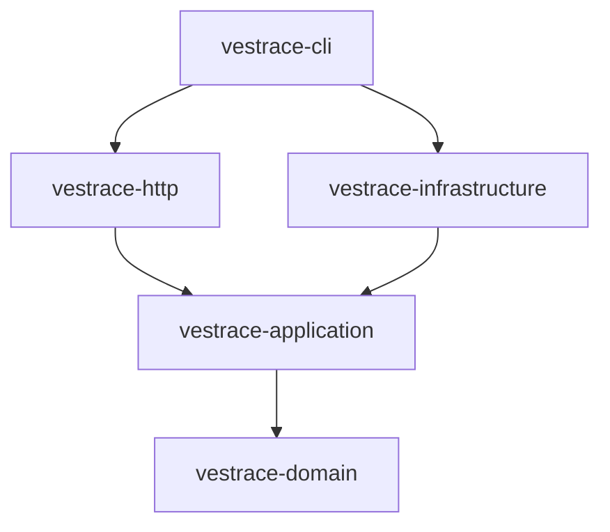

# Vestrace System Architecture

Vestrace is an evidence-first knowledge and execution platform. The core system is designed with Rust Edition 2024, adhering to clean architecture and domain-driven design principles.

## Workspace Structure

The project is structured as a Cargo workspace with five distinct member crates and a root-level integration test harness:

```text
Cargo.toml
crates/
  vestrace-domain/          # Pure domain types, invariants, and policies
  vestrace-application/     # Use cases, ports, commands, and outbox services
  vestrace-infrastructure/  # PostgreSQL persistence, SQLx drivers, and AI provider clients
  vestrace-http/            # Axum HTTP server and API routing
  vestrace-cli/             # Clap-based executable CLI binary
migrations/                 # Forward-only SQL schema migrations (0001 - 0016)
tests/                      # Root-level integration test suite
```

## Layer Responsibilities



### 1. Domain Layer (`vestrace-domain`)
- Contains zero external framework dependencies (no Axum, SQLx, or HTTP types).
- Strongly-typed UUID v7 identifiers (`WorkspaceId`, `MemoryId`, `EventId`, `JobId`, `ModelId`, etc.).
- Constrained domain scores (`Confidence`, `Importance`) with invariant validation.
- Aggregates and value objects: `Memory`, `MemoryRevision`, `Event`, `KnowledgeRelation`, `ContextPack`, `Capability`, `Sensitivity`, `ModelProfile`, `Agent`, `Skill`.

### 2. Application Layer (`vestrace-application`)
- Defines command DTOs (`RecordEventCommand`, `RememberMemoryCommand`, `LinkKnowledgeCommand`).
- Defines async repository and provider ports (`EventRepository`, `MemoryRepository`, `JobRepository`, `TextGenerationProvider`).
- Application services (`MemoryService`, `Worker`) handling transaction boundaries and outbox events.

### 3. Infrastructure Layer (`vestrace-infrastructure`)
- PostgreSQL adapters with `PgStore` connection pooling and `PgTransactionManager` scoped session variables (`vestrace.workspace_id`).
- Implementation of repository ports (`PgEventRepository`, `PgMemoryRepository`, `PgJobRepository`).
- OpenAI-compatible HTTP provider client (`OpenAiCompatibleClient`).

### 4. HTTP Layer (`vestrace-http`)
- Axum web server exposing health endpoints (`/health/live`, `/health/ready`).
- Tracing middleware injecting `x-request-id` and `x-correlation-id` headers into tracing spans.

### 5. CLI Layer (`vestrace-cli`)
- Command line interface subcommands: `server`, `worker`, `mcp`, `migrate`, `doctor`, `rebuild`.
