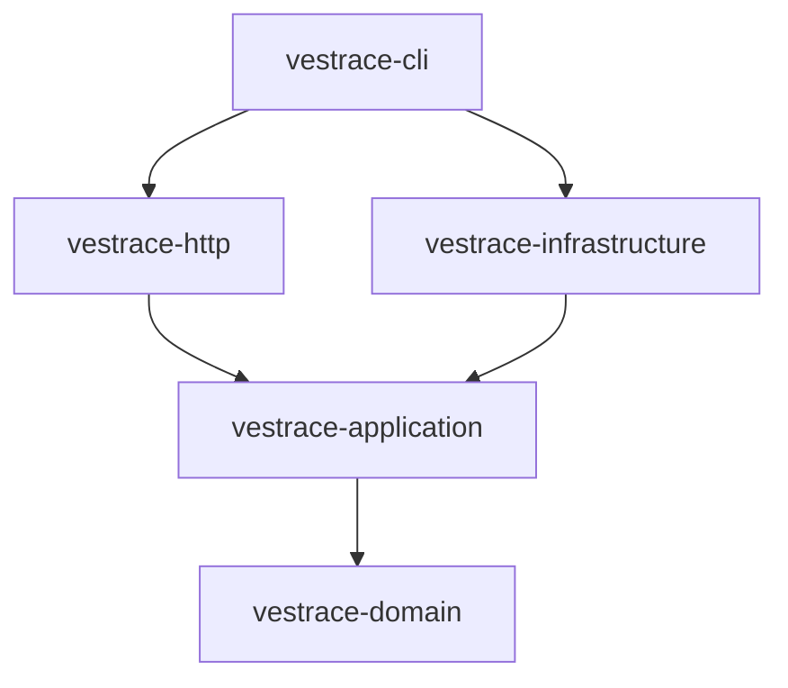

# Vestrace System Architecture

Vestrace is an evidence-first knowledge and execution platform implemented as a Rust Edition 2024 workspace. The supported P0 runtime is intentionally narrow: PostgreSQL-backed run records, health checks, workspace isolation, and truthful failure for unavailable product surfaces.

## Workspace structure

The repository contains six workspace crates plus a root integration-test package:

```text
Cargo.toml
crates/
  vestrace-domain/          # Pure domain types and invariants
  vestrace-application/     # Use cases and ports
  vestrace-infrastructure/  # PostgreSQL and provider adapters
  vestrace-http/            # Axum transport adapter
  vestrace-cli/             # Service and operational CLI
  vestrace-rig-spike/       # Experimental provider integration spike
tests/                      # Root integration test suite
migrations/                 # Ordered forward-only SQLx migrations
```

`vestrace-rig-spike` participates in workspace compilation and tests, but it is experimental and is not part of the supported P0 runtime contract.

## Layer dependencies



The intended dependency direction is inward:

- domain code does not depend on Axum, SQLx, HTTP, or infrastructure;
- application code defines use cases and ports without SQLx types;
- infrastructure implements application ports;
- HTTP translates transport requests into application calls;
- CLI performs composition and process startup.

## Current layer responsibilities

### Domain

`vestrace-domain` contains identifiers, value objects, entities, and invariants. The repository includes domain types for capabilities, memory, providers, agents, workflows, and other future areas. Their presence does not imply that those features are available through the supported runtime.

### Application

`vestrace-application` exposes ports and services used by the implemented run-record vertical slice and by internal foundation code. A type or service in this crate is not considered production-ready without a wired runtime path and acceptance coverage.

### Infrastructure

`vestrace-infrastructure` provides PostgreSQL pooling, transaction-scoped workspace/principal context, repository adapters, migration execution, migration-history verification, and provider clients.

The ordered `migrations/` directory embedded by SQLx is the migration source of truth. Documentation must not maintain a maximum migration number.

### HTTP

`vestrace-http` exposes:

```text
GET  /health/live
GET  /health/ready
POST /v1/runs
GET  /v1/runs
GET  /v1/runs/{id}
```

The HTTP crate depends on application ports and must not import SQLx or infrastructure adapters. Unsupported REST and AG-UI surfaces return explicit `501 Not Implemented` responses.

### CLI

Implemented commands:

- `server` — connect to PostgreSQL, apply and verify embedded migrations, then serve HTTP;
- `migrate` — connect to PostgreSQL, apply embedded migrations, and verify exact migration compatibility.

Explicitly unavailable commands return a non-zero exit status:

- `worker`;
- `mcp`;
- `doctor`;
- `rebuild`.

No unavailable command may report successful initialization or successful work.

## Database readiness

Process liveness and database readiness are distinct:

- `/health/live` reports that the HTTP process is running;
- `/health/ready` verifies database access and exact migration compatibility.

Compatibility compares every applied `_sqlx_migrations` entry with the embedded migration set by version, success state, and checksum. Missing, extra, failed, or modified migrations make the service not ready.

## P0 boundary

P0 does not provide:

- agent or workflow execution;
- deterministic run-event replay or checkpoint restoration;
- background workers;
- approval execution;
- capability-policy enforcement;
- artifact content-addressed storage;
- real AG-UI execution or streaming.

These capabilities must remain explicitly unavailable until their phase-specific acceptance gates pass.
