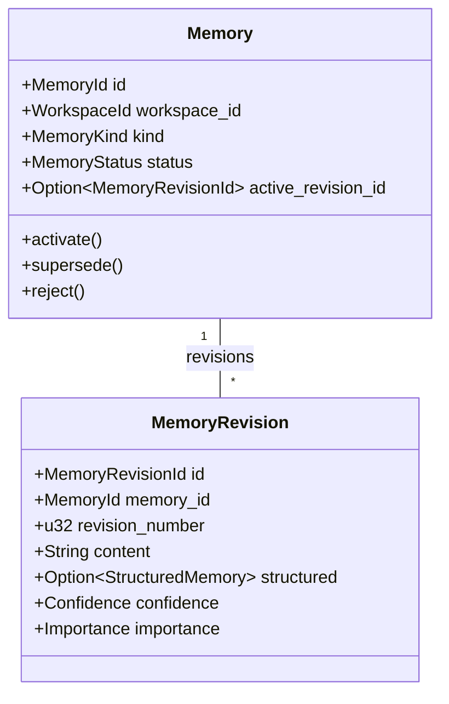

# Vestrace Domain Model Reference

The Vestrace domain model defines the core entities, value objects, and business invariant rules for knowledge storage, provenance tracking, cognitive execution, and event-sourced run lifecycle.

## Module status convention

Modules are marked **wired** when an application service and infrastructure adapter provide a runtime path, or **type-only** when the domain types exist but no wired service or HTTP endpoint exposes them yet.

## Core Domain Entities

### Memory Aggregates (`crates/vestrace-domain/src/memory/`) — partially wired

- **`MemoryKind`**: `Fact`, `Preference`, `Constraint`, `Decision`, `Task`, `Procedure`, `Observation`, `Outcome`, `Summary`.
- **`MemoryStatus`**: `Candidate`, `Active`, `Superseded`, `Rejected`, `Expired`, `Deleted`.
- **`Confidence` / `Importance`**: Newtype wrappers around `f32`, constrained strictly to $[0.0, 1.0]$. Values outside this interval or non-finite values trigger a `DomainError::InvalidArgument`.
- **`StructuredMemory`**: Tagged enum with schema-versioned variants (`v1.assertion`, `v1.decision`, `v1.task`, `v1.procedure`, `v1.observation`, `v1.outcome`, `v1.summary`).
- **State machine**: `new` starts as `Candidate`; `activate` only from `Candidate`/`Active`; `reject` only from `Candidate`; `supersede` only from `Active`; `expire` only from `Active` (clears `active_revision_id`); `soft_delete` from any non-`Deleted` state (clears `active_revision_id`). All violations yield `DomainError::PolicyViolation`.

**Wired**: `MemoryService` provides `record_event`, `remember_memory`, `revise_memory`, `link_knowledge` — all with idempotency key verification and outbox integration. `HardPurgeMemoryService` provides authorized hard purge. Write paths are implemented in `PgMemoryRepository`, `PgEventRepository`, `PgProvenanceRepository`, `PgRelationRepository`, `PgPurgeRepository`. Read paths (`find_memory_by_id`, `find_revision_by_id`, `find_by_id` for events) are implemented. Events are append-only (database trigger). Active memories require at least one source (deferred constraint trigger).

### Memory Write Policy (`crates/vestrace-domain/src/policy.rs`) — type-only

- **`MemoryWritePolicy`**: `Manual`, `Assisted`, `Automatic`.
- **`ActivationDecision`**: `AutoActivate`, `RequireApproval`, `DiscardCandidate`.
- **Decision rules**:
  - `Manual` → always `RequireApproval`.
  - `Automatic` → confidence ≥ 0.7: `AutoActivate`; ≥ 0.4: `RequireApproval`; < 0.4: `DiscardCandidate`.
  - `Assisted` → `AutoActivate` only when `kind ∈ {Fact, Preference}` AND confidence ≥ 0.85; otherwise `RequireApproval`.

### Event & Provenance Model (`crates/vestrace-domain/src/event.rs`, `provenance.rs`) — partially wired

- **`Event`**: Immutable event record containing `EventId`, `WorkspaceId`, `Option<SessionId>`, `event_type` (non-empty), `ActorRef` (`User`, `Agent`, `System`), `Option<SubjectRef>` (`Session`, `Channel`, `Resource`), JSON `payload`, and `created_at: Timestamp`.
- **`MemorySource`**: Evidence link connecting a `MemoryId` to its originating `EventId` with an `EvidenceRole` (`DirectSource`, `SupportingContext`, `ContradictingEvidence`). Direct sources have no derivation; derived sources always carry a `DerivationId`.
- **`DerivationMethod`**: `LlmExtraction { model, prompt_version }`, `RuleBased { rule_id }`, `ManualConsolidation`.

**Wired**: `MemoryService::record_event` persists events via `PgEventRepository::save` (write only). `PgProvenanceRepository::save_source` is fully wired.

### Knowledge Graph (`crates/vestrace-domain/src/relation.rs`) — wired (write only)

- **`KnowledgeRelation`**: Directed edge between `source_memory_id` and `target_memory_id`.
- **`RelationType`**: `Supports`, `Contradicts`, `Extends`, `Refines`, `DerivedFrom`, `RelatesTo`.
- Invariant: A relation cannot link a memory to itself (`source_memory_id != target_memory_id`), enforced in `KnowledgeRelation::new`.

**Wired**: `MemoryService::link_knowledge` persists via `PgRelationRepository::save_relation`.

### Context & Retrieval (`crates/vestrace-domain/src/retrieval/`) — partially wired

- **`RetrievalIntent`**: `SemanticRecall`, `CurrentState`, `DecisionRecall`, `Timeline`, `TaskResume`, `ProcedureLookup`, `UserPreferences`, `ErrorRecovery`, `ModelSelection`, `WorkflowContext`, `Exploration`.
- **`TimePerspective`**: `Current`, `AsOf(Timestamp)`, `Timeline`, `AllHistory`.
- **`RetrievalCandidate`**: Memory candidate with `memory_id`, `revision_id`, `score`, `channel_rank`, `channel`, and `explanation`.
- **`ScoreComponents`**: `fused_rank`, `scope_match`, `kind_match`, `importance`, `confidence`, `recency`, `provenance_quality`, `redundancy_penalty`.
- **`RepresentationLevel`**: `Full`, `Summary`, `Atomic`, `Reference`.
- **`ContextItem`**: `memory_id`, `revision_id`, `representation`, `rendered_text`, `accounted_tokens`, `source_ids`, `inclusion_explanation`.
- **`ContextSection`**: `label` + `items: Vec<ContextItem>`.
- **`ContextPack`**: Token-bounded context assembly with `sections`, `degraded`, and `warnings`. `used_tokens` cannot exceed `token_budget` (enforced in `ContextPack::new`).

**Wired**: `RetrievalService` orchestrates: normalize → text channel (`PgTextRetriever` FTS) → RRF fusion → deterministic rerank → context pack build → journal (`PgRetrievalJournal`). `ContextPackBuilder` builds token-bounded packs with section ordering and compression ladder. `reciprocal_rank_fusion` (RRF) combines channel results with deduplication. `rerank` applies deterministic score components. `NormalizedRetrievalRequest` normalizes requests with intent-based default kinds. Retriever ports (`TextRetriever`, `VectorRetriever`, `ExactRetriever`, `StructuredRetriever`, `RetrievalJournal`) are defined; `TextRetriever` and `RetrievalJournal` are wired to PostgreSQL adapters. Vector, exact, and structured retriever adapters are not yet wired.

### Run Event-Sourced State Engine (`crates/vestrace-domain/src/run/`) — wired

The run module implements a complete event-sourced state engine with commands, decisions, events, a reducer, and state.

#### Run Status & Version

- **`RunStatus`**: `Created`, `Ready`, `Running`, `WaitingForInput`, `WaitingForApproval`, `Completed`, `Failed`, `Cancelled`, `Stalled`.
  - `is_waiting()` → true for `WaitingForInput` / `WaitingForApproval`.
  - `is_terminal()` → true for `Completed` / `Failed` / `Cancelled` / `Stalled`.
- **`RunVersion`**: Newtype around `u64`. Must be positive (`new(0)` → `InvalidArgument`). `ZERO` = 0 (for create commands), `INITIAL` = 1. `next()` detects overflow.
- **`AgentRun`**: Read-model projection with `id`, `workspace_id`, `principal_id`, `title`, `status`, `version`, `created_at`, `updated_at`. Starts at `Created` / `INITIAL`.

#### Run State

- **`RunState`**: Canonical event-reduced state. Includes `active_step: Option<RunStepState>`, `wait: Option<RunWait>`, `completion: Option<RunCompletion>`, `started_at`, `finished_at`.
- **`RunActor`**: `Principal(PrincipalId)` or `System { component: String }`.
- **`RunStepState`**: `id`, `kind`, `label`, `status` (`Running`/`Completed`/`Failed`), `started_at`, `finished_at`.
- **`RunWait`**: `Input { request_id, prompt }`, `Approval { approval_id }`, `Job { job_id }`, `Event { event_type, correlation_id }`, `Timer { resume_at }`.
- **`RunCompletion`**: `Completed { summary }`, `PartiallyCompleted { summary, remaining_work }`, `Failed { code, message, retryable }`, `Cancelled { reason }`, `Stalled { reason: StallReason }`.
- **`StallReason`**: `NoProgress`, `VersionConflictLimit`, `InvalidState`, `ManualInterventionRequired`.

#### Run Events

- **`RunEventEnvelope`**: `event_id`, `workspace_id`, `run_id`, `sequence: RunVersion`, `event_type: String`, `event_version: u16`, `actor`, `causation_id: OperationId`, `correlation_id: CorrelationId`, `payload: RunEvent`, `occurred_at`, `recorded_at`.
- **`RunEvent`**: `Created`, `MarkedReady`, `Started`, `StepStarted`, `StepCompleted`, `StepFailed`, `WaitingForInput`, `WaitingForApproval`, `Resumed`, `Completed`, `Failed`, `Cancelled`, `Stalled`.
  - Each variant carries a stable `event_type()` string (e.g. `"run.created"`, `"step.started"`) and `event_version()` = 1.

#### Run Commands

- **`RunCommandEnvelope`**: `command_id: OperationId`, `idempotency_key: Option<String>`, `workspace_id`, `run_id`, `actor`, `expected_version: RunVersion`, `correlation_id`, `issued_at`, `command: RunCommand`.
- **`RunCommand`**: `Create`, `MarkReady`, `Start`, `StartStep`, `CompleteStep`, `FailStep`, `WaitForInput`, `WaitForApproval`, `Resume`, `Complete`, `Fail`, `Cancel`, `MarkStalled`.

#### Decision Function (`decide`)

`decide(state: Option<&RunState>, command: &RunCommandEnvelope) -> Result<Vec<PendingRunEvent>, RunDecisionError>`

Enforces:
- `Create` rejected if state already exists (`AlreadyExists`); requires `expected_version == ZERO`.
- Non-create commands require `expected_version == state.version` (optimistic concurrency).
- Workspace and run ID in envelope must match state.
- Commands rejected when status is terminal (`InvalidTransition`).
- State-machine guards: `MarkReady` from `Created`; `Start` from `Ready`; step commands from `Running` with matching/no active step; `Resume` from waiting; `Complete` from `Running` with no active step; `Fail`/`Cancel`/`MarkStalled` from any non-terminal state.
- `required_text` rejects empty/whitespace for `title`, `kind`, `code`, `message`, `prompt`.

#### Reducer (`apply` / `replay`)

`apply(state: Option<RunState>, event: &RunEventEnvelope) -> Result<RunState, RunReduceError>`

`replay(events: impl IntoIterator<Item = RunEventEnvelope>) -> Result<Option<RunState>, RunReplayError>`

Enforces:
- First event must be `Created`; `DuplicateCreatedEvent` on existing state.
- `event_type` field must match `payload.event_type()`; `event_version` must match `payload.event_version()` (= 1).
- First event `sequence` must equal `INITIAL`; subsequent must equal `state.version.next()`.
- Workspace, run ID, and terminal-state checks on subsequent events.
- State-machine transitions mirrored from the decision function.
- Each event updates `state.version` and `state.updated_at`.

#### Projection & Recovery

- **`project_run(state: &RunState) -> AgentRun`** (in `vestrace-application`): derives the read-model projection from canonical state.
- **`RunRecoveryService`** (in `vestrace-application`): checkpoint creation (SHA-256 state hash), validation, restoration from checkpoint + tail events, and projection rebuild. Checkpoint format version = 1.

**Wired**: `RunCommandService` → `PgRunEventStore` + `PgRunCommandCommitter`. `RunService` → `PgRunRepository`. `RunRecoveryService` → `PgRunRecoveryStore`. All wired through `commands/server.rs` and the HTTP `POST /v1/runs` endpoint.

### State Engine Extensions (`crates/vestrace-domain/src/state_engine/`) — type-only

- **`CaptureProfile`**: `Minimal`, `Operational`, `Reproducible`, `Forensic`.
- **`SignedRunExport`**: Tamper-evident export with `signature`, `profile`, `run_id`.

### Security & Capabilities (`crates/vestrace-domain/src/security/`) — partially wired

- **`Capability`**: 21 granular RBAC permissions (`memory.read`, `memory.write`, `memory.purge`, `event.read`, `event.write`, `context.retrieve`, `agent.read`, `agent.write`, `skill.read`, `skill.write`, `workflow.read`, `workflow.write`, `execution.read`, `execution.write`, `model.read`, `model.write`, `provider.read`, `provider.write`, `audit.read`, `export.read`, `workspace.admin`). Round-trippable string ↔ enum.
- **`Sensitivity`**: Hierarchical sensitivity levels (`Public` < `Internal` < `Confidential` < `Restricted`), derived `Ord`. Unknown/missing classification defaults to `Confidential`.
- **`DataDestination`**: `LocalModel`, `RemoteProvider`, `LogOutput`, `AuditStore`, `ExportBundle`.
- **`ApprovalKind`**: `HardPurge`, `PermissionChange`, `ProviderEnablement`, `RestrictedTransfer`, `ExportBundle`.
- **`ApprovalStatus`**: `Requested` → `AwaitingApproval` → `Approved` | `Rejected` | `Expired`.
- **`ApprovalRecord`**: Lifecycle state machine with `approve()`, `reject()`, `is_valid()`. Approved records bind approver, operation hash, and expiry.
- **`AuditEvent`**: Immutable audit record with `action`, `resource_type`, `resource_id`, `payload`.

**Wired**: `PolicyEngine` port with `AllowAllPolicyEngine`, `CapabilitySetPolicyEngine`, `WorkspaceScopedPolicyEngine` implementations. `RedactionService` with regex-based redaction and sensitivity-aware destination filtering. `AuditRepository` port with `PgAuditRepository` adapter. HTTP auth middleware (local trusted mode). Not yet wired: PolicyEngine enforcement in HTTP routes, production approval authorization.

### Budget (`crates/vestrace-domain/src/budget.rs`) — type-only

- **`BudgetAccount`**: `hard_limit` must be non-negative. `reserve(amount)` rejects negative amounts and over-limit reservations (`balance + amount > hard_limit` → `PolicyViolation`).

### Models (`crates/vestrace-domain/src/models/`) — type-only

- **`ModelProfile`**: `id`, `provider_id`, `name`, `context_window`, `cost: ModelCostProfile`.
- **`ModelCostProfile`**: `input_cost_per_mtoken`, `output_cost_per_mtoken` — both must be non-negative.
- **`ModelExecutionAttempt`**: `attempt_number`, `status` (`Success`/`Failed`/`FallbackTriggered`).

### Jobs (`crates/vestrace-domain/src/job.rs`) — partially wired

- **`JobState`**: `Pending`, `Leased`, `Completed`, `Failed`, `DeadLetter`.
- **`Job`**: `job_type`, `payload`, `state`, `attempts`, `max_attempts`, `run_at`, `leased_until`.

**Wired**: `PgJobRepository` implements `enqueue`, `lease_next` (`FOR UPDATE SKIP LOCKED`), and `complete`. The CLI `worker` command runs a job-processing loop with graceful shutdown.

### Type-Only Domain Modules

The following modules define domain types but have no wired application service, infrastructure adapter, or HTTP endpoint:

| Module | Key types |
| :--- | :--- |
| `a2a` | `RemoteAgentInvocation`, `InvocationStatus` |
| `ag_ui` | `AgUiEndpoint` |
| `artifact` | `Artifact`, `ArtifactRevision`, `ArtifactStatus` |
| `cognitive` | `Agent`, `Skill` |
| `connection` | `Connector`, `Connection`, `ConnectionStatus` |
| `conversation` | `ConversationThread`, `ExternalTrigger`, `ChannelType` |
| `enterprise` | `WorkspaceKek`, `CrossWorkspaceMemoryGrant` |
| `observability` | `MetricRollup` |
| `package` | `AgentPackage` |
| `planning` | `ExecutionPlan`, `ExecutionPlanRevision`, `PlanningMode` |
| `product` | `ProductRelease`, `InteractionSession`, `SessionStatus` |
| `product::transfer` | `ProductApiTransfer`, `TransferType`, `TransferStatus` |
| `release` | `ReleaseManifest` |
| `tool` | `ToolDefinition`, `ToolInvocation`, `ToolBindingKind`, `ToolInvocationStatus` |
| `webhook` | `WebhookSubscription` |

## Cross-Cutting Invariants

| Invariant | Where enforced |
| :--- | :--- |
| No `unsafe` code anywhere in the domain crate | `lib.rs` `#![forbid(unsafe_code)]` |
| All timestamps are UTC | `time::Timestamp` alias |
| All IDs are UUIDv7 opaque newtypes | `id` macro |
| `Confidence` / `Importance` bounded to `[0.0, 1.0]` and finite | `memory::kind` |
| Memory status state machine | `memory::revision::Memory` |
| Memory-write activation policy thresholds | `policy::MemoryWritePolicy::evaluate` |
| Relation source ≠ target memory | `relation::KnowledgeRelation::new` |
| `event_type` non-empty | `event::Event::new` |
| `RunVersion` must be positive; no overflow on `next` | `run::RunVersion` |
| Run optimistic concurrency | `run::decision::decide` |
| Run command/state-machine guards per `RunStatus` | `run::decision` & `run::reducer` |
| Run event envelope type/version/sequence/workspace/run consistency | `run::reducer::validate_envelope` |
| First run event must be `Created`; no events after terminal | `run::reducer` |
| `ContextPack` used_tokens ≤ token_budget | `retrieval::ContextPack::new` |
| `ModelCostProfile` costs non-negative | `models::ModelCostProfile::new` |
| `BudgetAccount` hard_limit non-negative; reserve non-negative; no over-limit | `budget::BudgetAccount` |
| `Capability` string parsing rejects unknown capabilities | `security::Capability::from_str` |
| Stable `DomainError` codes | `error::DomainError::code` |
