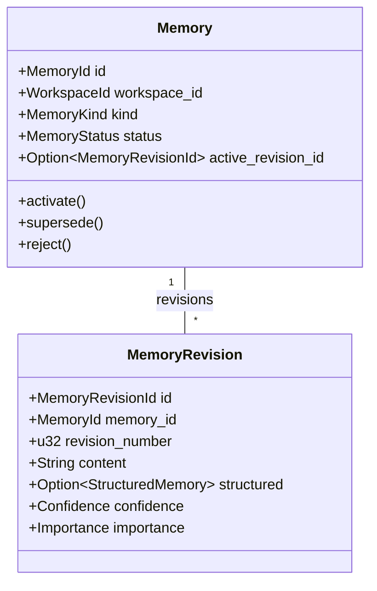

# Vestrace Domain Model Reference

The Vestrace domain model defines the core entities, value objects, and business invariant rules for knowledge storage, provenance tracking, and cognitive execution.

## Core Domain Entities

### Memory Aggregates (`crates/vestrace-domain/src/memory/`)

- **`MemoryKind`**: `Fact`, `Preference`, `Constraint`, `Decision`, `Task`, `Procedure`, `Observation`, `Outcome`, `Summary`.
- **`MemoryStatus`**: `Candidate`, `Active`, `Superseded`, `Rejected`, `Expired`, `Deleted`.
- **`Confidence` / `Importance`**: Values constrained strictly to $[0.0, 1.0]$. Values outside this interval trigger a `DomainError::InvalidArgument`.

### Event & Provenance Model (`crates/vestrace-domain/src/event.rs`, `provenance.rs`)

- **`Event`**: Immutable event record containing `EventId`, `WorkspaceId`, `ActorRef` (`User`, `Agent`, `System`), `event_type`, and JSON payload.
- **`MemorySource`**: Evidence link connecting a `MemoryId` to its originating `EventId` with an `EvidenceRole` (`DirectSource`, `SupportingContext`, `ContradictingEvidence`). Active memories require at least one valid source.

### Knowledge Graph (`crates/vestrace-domain/src/relation.rs`)

- **`KnowledgeRelation`**: Directed edge between `source_memory_id` and `target_memory_id`.
- **`RelationType`**: `Supports`, `Contradicts`, `Extends`, `Refines`, `DerivedFrom`, `RelatesTo`.
- Invariant: A relation cannot link a memory to itself (`source_memory_id != target_memory_id`).

### Context & Retrieval (`crates/vestrace-domain/src/retrieval/`)

- **`RetrievalCandidate`**: Memory candidate scored by retrieval pipeline with explanation.
- **`ContextPack`**: Token-bounded context assembly. `used_tokens` cannot exceed `token_budget`.

### Security & Capabilities (`crates/vestrace-domain/src/security/`)

- **`Capability`**: Granular RBAC permissions (`memory.read`, `memory.write`, `memory.purge`, `event.read`, `event.write`, `context.retrieve`).
- **`Sensitivity`**: Hierarchical sensitivity levels (`Public` < `Internal` < `Confidential` < `Restricted`).
